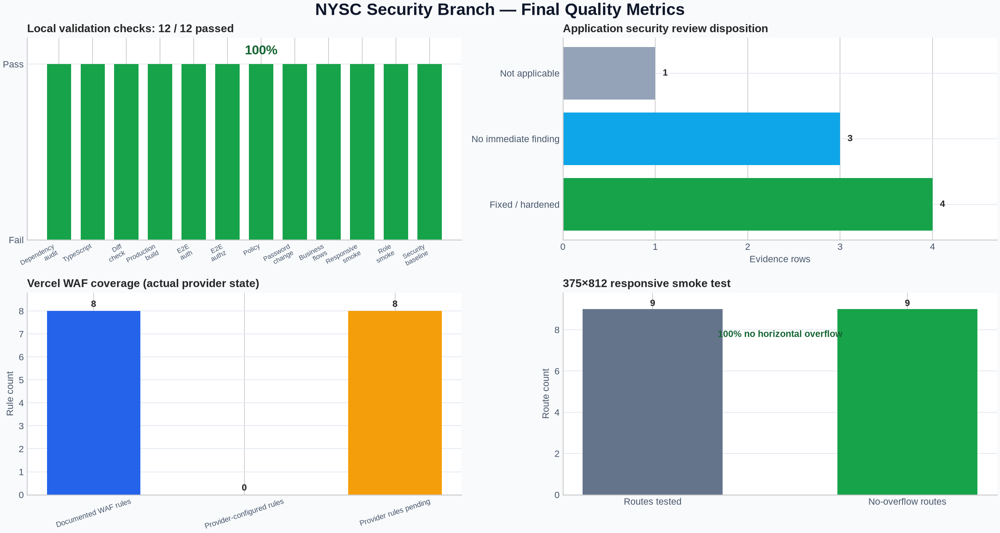

# NYSC Final Project Audit

**Repository:** `akeemadetunji1234-wq/NYSC`
**Branch:** `security/authorization-isolation-audit`
**Author:** Manus AI
**Scope:** Authentication theme consistency, performance diagnosis, phone-width quality, profile password security, security validation, dependency review, visual metrics, and deployment readiness.

## Executive result

The local quality pass completed successfully. The branch was cleanly based on the previously hardened authorization branch, and the final audit runner recorded **12 of 12 checks passing** against the isolated local test environment.

The current changes make all sign-in, registration, recovery, reset, and Google-verification surfaces light by default—even when a dark dashboard preference is persisted—prepare a light-mode transition before every discovered member, agent, and admin sign-out path, optimize the public hero image through Next.js image handling, reduce avoidable client startup and first-paint work on protected routes, align the package manager with Vercel’s pnpm 10 installer, add a reusable 375×812 responsive smoke test with an automated persisted-dark home-to-sign-in assertion, and provide a shared authenticated password-change flow for CORP, AGENT, and ADMIN profiles.

The main remaining operational items are provider-side rather than repository-side. The Vercel integration exposes deployment reads but not Firewall/Bot Management rule mutation, and production `RESEND_API_KEY` and historical `NEXTAUTH_SECRET` rotation still require the authenticated Resend/Vercel dashboards. Those actions remain explicitly pending; this audit does not treat source changes as credential rotation or WAF deployment.



## Changes completed

| Area | Result | Evidence |
|---|---|---|
| Authentication theme | Added a route-aware `AuthTheme` boundary to sign-in, sign-up, forgot-password, reset-password, and Google-verification flows. It forces the auth surface to `light`, sets `color-scheme: light`, suppresses persisted dark/system classes, overrides semantic tokens inside the full-viewport surface, and restores the prior dashboard theme after auth navigation. | `src/app/components/Auth/AuthTheme.tsx`, auth pages under `src/app/{signin,signup,forgot-password,reset-password,verify-google}`, `src/components/ThemeProvider.tsx`, `src/styles/theme.css` |
| Sign-out consistency | Added a pre-navigation light-mode helper to all discovered member, agent, and admin logout controls, including profile and mobile shell variants. | `git grep signOut` review; affected files under `src/components/layout` and `src/app/{member,admin}` |
| Home-page loading | Replaced the CSS background hero image with a `next/image` fill image using `priority` and `sizes="100vw"`; made the scroll listener passive. | `src/app/App.tsx` |
| Client startup and first paint | Scoped `SessionProvider` to protected role layouts, hydrated it with the server-validated session, removed duplicate role theme providers, made count-up frames cancelable/reduced-motion aware, coalesced scroll updates, and removed the blank-looking initial page-transition state. | `src/app/layout.tsx`, protected role layouts, `src/components/auth/AuthProvider.tsx`, `src/components/layout/PageTransition.tsx`, `src/app/App.tsx`; detailed analysis in [`PERFORMANCE_BOTTLENECK_ANALYSIS.md`](PERFORMANCE_BOTTLENECK_ANALYSIS.md) |
| Mobile testability | Added a DevTools Protocol smoke test that emulates 375×812, waits for hydration, verifies the persisted-dark homepage-to-sign-in route is light by computed style, checks document/body width, records redirects, and writes optional route captures to temporary output. It covers public, auth, member, agent, admin, and all three profile/settings entry points. | `scripts/phone-responsive-smoke.mjs`, `package.json` (`test:responsive`) |
| Profile password security | Added a shared authenticated server action that validates the current password, requires a 12–128 character replacement, hashes with bcrypt, increments `sessionVersion`, revokes stored sessions, and records a redacted security event. The same dialog is available in member, agent, and admin profiles. | `src/lib/passwordChange.ts`, `src/app/actions/auth.ts`, `src/components/auth/PasswordChangeDialog.tsx`, profile pages |
| Audit reproducibility | Added a sequential audit runner and a deterministic chart generator. | `scripts/run-final-audit.sh`, `scripts/generate-audit-visuals.py` |

## Local validation

The audit runner uses `.env.test.local` for test commands, writes command output to `docs/audit-assets/test-results/`, and does not print secret values. The local integration server was also restarted with the same isolated environment before the final run; every check exited with status zero.

| Check | Result | Duration |
|---|---:|---:|
| Dependency audit | Pass | 2 s |
| TypeScript | Pass | 4 s |
| Git diff check | Pass | <1 s |
| Production build | Pass | 18 s |
| E2E authentication | Pass | 3 s |
| E2E authorization isolation | Pass | 2 s |
| Authorization policy | Pass | 1 s |
| Password change | Pass | 4 s |
| Business flows | Pass | 3 s |
| Responsive smoke | Pass | 33 s |
| Role integration smoke | Pass | 5 s |
| Security audit baseline | Pass | 6 s |
| **Total** | **12 / 12 (100%)** | **81 s recorded command time** |

The dependency audit reported zero advisories. The separate `pnpm outdated --format json` review found 59 packages with newer releases available, but it was intentionally not converted into a blind bulk upgrade: newer versions are not automatically security fixes, and the already-applied parent updates and narrow overrides had cleared the active audit findings. The repository does not expose a Prettier executable through the current installation, so formatting verification was performed with TypeScript, `git diff --check`, the production build, and the security baseline runner; the missing formatter is recorded as a tooling gap rather than silently claimed as a pass.

## Performance diagnosis

Static HTML response timings were measured locally on both the development server and a temporary production server. Development responses were approximately 30–60 ms TTFB for the public and auth pages. The optimized production server returned approximately 4–8 ms TTFB for `/`, `/signin`, and `/signup`. Its database-backed `/api/health` check returned successfully at approximately 86 ms, which is consistent with database connection/query work rather than a static page bottleneck.

These measurements make a persistent static-server delay unlikely for the public landing and authentication pages. The more plausible sources of intermittent perceived slowness are browser-side hydration and motion work, image transfer/decoding, route-level database queries, and serverless/database cold-start variability on protected flows. This pass removes several avoidable client costs: public routes no longer mount NextAuth context, protected SessionProviders reuse the server session, duplicate theme providers are gone, protected content is no longer intentionally hidden for an initial 260 ms transition, and landing-page animation updates are coalesced or canceled where appropriate. The remaining protected-route performance should be profiled in the deployed environment with route-specific runtime logs and query timings before adding caching or changing data freshness behavior. See the detailed [`PERFORMANCE_BOTTLENECK_ANALYSIS.md`](PERFORMANCE_BOTTLENECK_ANALYSIS.md) for the evidence and follow-up recommendations.

## Phone-width verification

The smoke test emulated a **375×812** phone viewport and exercised `/`, `/signin`, `/signup`, `/member`, `/agent`, `/admin`, `/member/profile`, `/agent/settings`, and `/admin/profile`. Before the route sweep, it set `localStorage.theme = "dark"`, reloaded the homepage, clicked the actual first `a[href="/signin"]` homepage anchor, and checked `/signin`, `/signup`, `/forgot-password`, `/reset-password`, and `/verify-google` for a mounted light auth surface by computed style. All five auth routes passed; sign-in reported `--card: #fff` and `inputBackground: rgb(255, 255, 255)`, while token-only states correctly reported the same light surface. All nine route checks reported `documentWidth = bodyWidth = viewportWidth = 375`, so the test found **no horizontal overflow**. The six protected entry/profile routes correctly redirected unauthenticated visitors to `/signin`. The interactive browser session independently confirmed the same homepage-link behavior.

A headless Chromium screenshot encoder produced blank white PNGs even when the DOM was hydrated and the width assertions passed. Optional captures are written outside the repository by default, so unusable images do not pollute the project; the width/redirect metrics are the authoritative responsive evidence in this environment. Authenticated dashboard phone navigation was not claimed as complete because the existing test harness is HTTP-oriented and intentionally avoids production credentials; the role shells were statically reviewed and their unauthenticated entry boundaries were exercised.

## Vercel deployment verification

The first deployment created from commit `42b8845` failed before the application build because Vercel uses pnpm 10.x and rejected the lockfile’s `patchedDependencies` configuration. The repository was corrected by pinning `packageManager` to `pnpm@10.4.1` and regenerating the lockfile with the same major-version installer. The password-change release from commit `567f57afb1b54361ba3bfbffe897380e1a092657` reached **READY** in the `iad1` region. After this auth-surface fix was pushed, Vercel created deployment `dpl_CwqgiYJmUrYrx2X4GR7H67vVVbVt` for commit `c9bcdb0ac88c42f6fc3558cab9637cc24c25455d`; its build logs ended with **Build Completed**, **Deployment completed**, and `readyState: READY` in `iad1`. The stable branch alias is [`nysc-git-security-authori-126f25-akeemadetunji1234-wqs-projects.vercel.app`](https://nysc-git-security-authori-126f25-akeemadetunji1234-wqs-projects.vercel.app/).

The current preview URL and branch alias are protected by the project’s Vercel Authentication/SSO layer. A provider fetch of the new deployment root returned HTTP 302 to the Vercel SSO endpoint, with HSTS and `X-Frame-Options: DENY`; the temporary share-link fetch was also redirected by the provider’s protection flow. Therefore the deployment build and route generation are verified, but the deployed auth form itself could not be visually inspected from the current unauthenticated preview session. Local `/signin` behavior, the all-auth-route computed-style smoke test, the profile password-change persistence test, and the complete local auth lifecycle remain verified.

## Security and WAF coverage

The supplemental security audit contains eight evidence rows. Four are marked fixed or hardened, three have no immediate finding, and one is not applicable to the current PostgreSQL/Prisma stack. The application-level protections are therefore distinct from the hosting-provider WAF layer.

| Control layer | Documented | Actually configured or verified here | Status |
|---|---:|---:|---|
| Application security evidence rows | 8 | 8 reviewed | 4 fixed/hardened; 3 no immediate finding; 1 not applicable |
| Vercel WAF rules | 8 exact rules documented | 0 provider rules mutated or verified through current access | **8 pending provider configuration** |
| Local dependency advisories | 0 | 0 | Pass |
| Historical secret remediation | Rotation procedure documented | Provider mutation unavailable | **Pending Resend/Vercel dashboard action** |

The eight documented WAF rules cover managed exploit detection, aggregate authentication limits, stricter credential/register/reset limits, upload limits, bot management, admin/Pusher/private-document protection, suspicious host/proxy-header blocking, and authenticated rate-limit keys. They are specified in [`SECURITY_AUDIT_SUPPLEMENT.md`](SECURITY_AUDIT_SUPPLEMENT.md) and [`SECURITY_EDGE_CONTROLS.md`](SECURITY_EDGE_CONTROLS.md), but they must not be represented as deployed until they are entered and verified in Vercel Firewall/Bot Management.

## Repository quality and residual work

The changed TypeScript compiled successfully, the production build completed, and the security baseline runner passed. The branch also includes the earlier authorization inventory and two-account negative tests covering private records, private channels, admin denial, and business-flow role boundaries. No secrets are included in this report or the generated chart.

The residual provider actions are to rotate the historically exposed Resend and NextAuth credentials, update encrypted Vercel environment variables, invalidate any old sessions/tokens as applicable, configure the eight WAF/Bot Management rules, and verify challenge/deny events in provider logs. These steps require authenticated provider mutation access and are not safely executable from the current read-only deployment connector.

## Reproducibility

Run the complete local quality pass from the repository root with:

```bash
bash scripts/run-final-audit.sh
```

Run only the phone-width check with:

```bash
pnpm test:responsive
```

Run only the isolated CORP/AGENT password-change check with:

```bash
pnpm test:password-change
```

The generated results table is [`audit-assets/test-results/results.tsv`](audit-assets/test-results/results.tsv), the supporting responsive notes are [`mobile-responsive-findings.md`](mobile-responsive-findings.md), the auth regression notes are [`auth-theme-regression-findings.md`](auth-theme-regression-findings.md), and the detailed performance analysis is [`PERFORMANCE_BOTTLENECK_ANALYSIS.md`](PERFORMANCE_BOTTLENECK_ANALYSIS.md).

## References

[1]: SECURITY_AUDIT_SUPPLEMENT.md "Security Audit Supplement"
[2]: SECURITY_EDGE_CONTROLS.md "Security Edge Controls"
[3]: AUTHORIZATION_INVENTORY.md "Authorization Inventory"
[4]: audit-assets/test-results/results.tsv "Final Audit Result Table"
[5]: mobile-responsive-findings.md "Mobile Responsive Findings"
